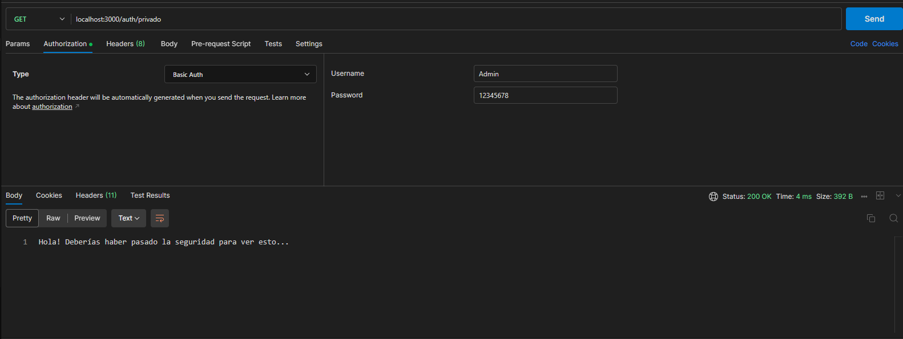
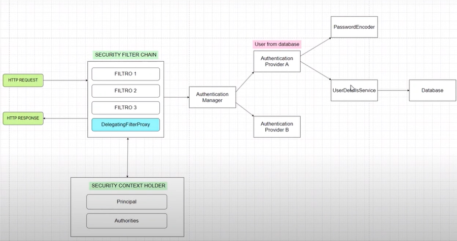

# Spring security proyecto

Vamos a usar Spring Security. Esto está dicho de tener muchos pasos así que ir con precaución.
Vamos a usar vistas pre cargadas

## Novedades

- Ahora tenemos un nuevo package llamado `com.pawpengaga.config` que se encarga de la SECURITY FILTER CHAIN de Spring Security

## Objetivos del día 2

- Usar un login propio a nivel de diseño
- Indagar en lo que hace `SECURITY CONTEXT HOLDER`

## Resultados

## Pendientes

- Usar las validaciones

## Flujo general de Spring Security

---

## La JWT UPDATE está aqui

Se puede ver todo tipo de documentación al respecto [aquí](https://github.com/auth0/java-jwt)

#### Cosas que tener en cuenta

- Construir el payload
- Construir la clave secreta

### Observaciones

- Se pueden declarar todo tipo de variables en `application.properties`