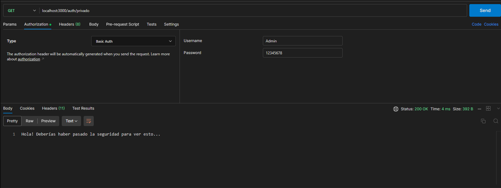

# Spring security proyecto

Vamos a usar Spring Security. Esto está dicho de tener muchos pasos así que ir con precaución.
Vamos a usar vistas pre cargadas

## Novedades

- Ahora tenemos un nuevo package llamado `com.pawpengaga.config` que se encarga de la SECURITY FILTER CHAIN de Spring Security

## Resultados

